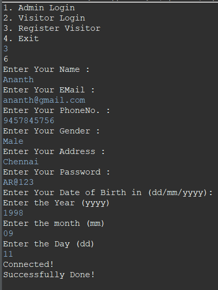
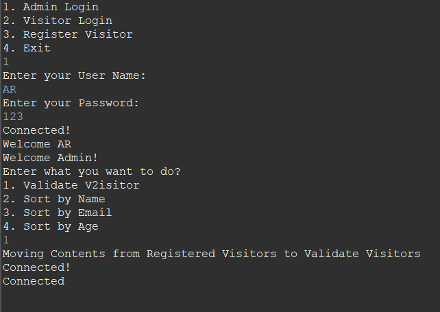

# UserAuthenticationForPub
UserAuthenticationForPub is a secure and efficient code that provides authentication and authorisation for pub visitors. It offers a secure admin login for pub owners and managers to manage user data. For new visitors, it enables a registration portal for easy registration of their visit. For valid visitors, it provides various options to enhance their pub experience. Overall, this code helps to maintain the security and manage the flow of visitors in a pub.

[](LICENSE)

## Thank You!
Please ⭐️ this repo and share it with others

## Screenshots
  | 

## Requirements 🔧
* Java 8 or higher.
* Maven Project with MySQL and lombok dependencies.

## Installation 🔌
1. Press the **Fork** button (top right the page) to save copy of this project on your account.

2. Download the repository files (project) from the download section or clone this project by typing in the bash the following command:

       git clone https://github.com/RamAnanth11/UserAuthenticationForPubr.git
3. Imported it in Eclipse IDE.
4. Run the application. Navigate to controller and run the command below.
```
javac Controller.java
```
